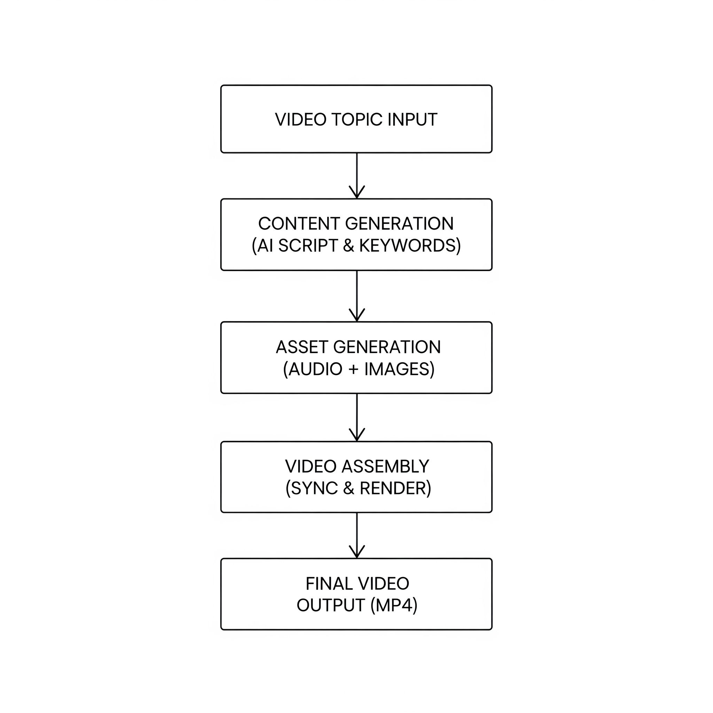

# YouTube Content Automation Tool

## Problem Statement

Vedantu operates 25+ active YouTube channels, publishing 1,000+ videos per month. This scale makes manual video creation by Master Teachers impractical, time-consuming, and expensive. Tasks like research, scripting, recording, editing, and metadata optimization drain valuable educator time and slow down content velocity.

## Why This Solution Matters

This tool automates the entire educational video production pipeline ie. from topic scripting to final rendered video, enabling scalable, high-quality content creation without relying on individual teachers. It significantly boosts output while ensuring consistent video quality and metadata relevance for discoverability.

---

## Solution Overview

### Core Features

- **Topic-based script generation** using Google Gemini API.
- **Voiceover narration** via Google Text-to-Speech (gTTS).
- **Visual asset generation** using Pexels image API.
- **Video rendering** using `moviepy` to stitch audio + images into HD output.
- **Metadata automation**: keywords and timestamps aligned with scene structure.

This solution runs end-to-end in a single Google Colab notebook with minimal setup.

---

## Key Questions Answered

### 1. How would you identify what content to create?

By leveraging:
- Trending keywords from YouTube/Google Trends
- Vedantu’s video analytics
- Common student queries

A future version can integrate YouTube Data API + Google Trends to auto-pick topics based on subject, region, and past performance.

---

### 2. What data sources could inform better content decisions?

- YouTube Analytics (CTR, watch time, impressions)
- Comment scraping for student pain points
- Google Trends, Quora, Reddit (for organic demand)
- Exam blueprints and NCERT syllabus for curriculum alignment

---

### 3. How would you maintain educational quality while scaling production?

- Use structured LLM prompts for scene-by-scene generation
- Short, concise narration per slide ensures clarity
- Visual keyword-based image search keeps context relevant
- Add QA checks (e.g., hallucination detection, script audit) in future

---

### 4. What repetitive tasks in the content pipeline could be automated?

- Topic research and structuring
- Script writing
- Voiceover generation
- Image selection
- Video editing and stitching
- YouTube title, tags, description generation (this would be in future)

---

### 5. How would you ensure the generated content performs well on YouTube?

- Scene-based structure maps well to chapters (retention-friendly)
- Thumbnails can be auto-generated from scene images in future
- A/B testing titles and formats can improve CTR and engagement

---

## Tech Stack

| Layer | Tools |
|-------|-------|
| Script Generation | Google Gemini 1.5 API |
| Voiceover | gTTS (Google Text-to-Speech) |
| Image Assets | Pexels API (free stock images) |
| Video Assembly | moviepy, PIL |
| Language | Python |
| Environment | Google Colab Notebook |

---

## Architecture Diagram

---
## Setup Instructions

Follow these steps to run the project smoothly in Google Colab. No paid tools or subscriptions are required, all APIs used have free tiers suitable for testing this out.

### 1. Open the Colab Notebook

Click the link below to open the fully runnable notebook in Google Colab:  
**[Colab Notebook - Run It Here](https://colab.research.google.com/drive/1p3MxuWx7676DuhPN7uy_zf0l6gOnI4VF?usp=sharing)**

---

### 2. Generate Free API Keys (One-time Setup)

The notebook requires two API keys - both are free and take less than 2 minutes to generate.

#### a) Google Generative AI (Gemini) API Key – for Script Generation
- Visit: [https://makersuite.google.com/app/apikey](https://makersuite.google.com/app/apikey)
- Sign in with your Google account
- Click **"Create API Key"**
- Copy the key and paste it into `GOOGLE_API_KEY` in the notebook

**Free Usage Limits:**  
- As of July 2025, Gemini 1.5 Flash is **free for personal use**, with up to **60 requests per minute** (subject to change by Google).

#### b) Pexels API Key – for Free Stock Images
- Visit: [https://www.pexels.com/api/](https://www.pexels.com/api/)
- Click “Get Started” and create an account
- Copy your **personal API key**
- Paste it into `PEXELS_API_KEY` in the notebook

**Free Usage Limits:**  
- The free tier allows up to **200 requests/hour** and **20,000 requests/month** - more than enough for this tool.

---

### 3. Run the Notebook

Once both API keys are pasted:
- Run the notebook
- Enter any video topic (e.g., `"Photosynthesis for Class 10"`)

The tool will:
1. Generate a structured 4–6 scene script using Gemini
2. Create voiceover narration for each scene using Google TTS
3. Fetch related stock images from Pexels
4. Combine images and audio using `moviepy` into a stitched video

---

### 4. Output

The final video will be saved as:

`/output/final_video.mp4`

You can play it directly within Colab or download it to your system and play it.

---

### Optional

To view intermediate assets:
- Audio files are saved in `/assets/` as `audio_0.mp3`, `audio_1.mp3`, etc.
- Image files are saved in `/assets/` as `image_0.jpg`, `image_1.jpg`, etc.

---

**Note:** No paid services or subscriptions are required to run this tool. Everything has been built using **free-tier APIs** suitable for demo use.

---

## Sample Input & Output

| Input | Output |
|-------|--------|
| `"Photosynthesis for Class 10"` | 4-6 scene educational video with voiceover and synced visuals |

Assets are saved in:
- `/assets/`: per-scene audio and image
- `/output/`: final rendered video

---

## Evaluation Checklist

| Criteria | Addressed? |
|----------|------------|
| **Functionality** | Full end-to-end pipeline, no manual patchwork |
| **Quality & Performance** | Structured scene narration, relevant visuals |
| **Automation Depth** | LLM prompt chaining, audio/image generation, video rendering |
| **Code Quality** | Modular, well-commented, handles edge cases |
| **Relevance** | Basic video creation for the given topic |
| **Crispness** | 1-page summary + working code in a few minutes |

---
## Demo Videos

- **30-Second Demo Walkthrough:**  
  [Google Drive Link - How to run](https://drive.google.com/file/d/1o8XBP0wrasJGuv79YLuSbMmD1QzlcRmM/view?usp=drive_link)

- **Full Generated Sample Video:**  
  [Google Drive Link - Output Video](https://drive.google.com/file/d/1aPsxjCF-MsA1lqe9U4ZLLUkpCVEfc08E/view?usp=drive_link)

---

## Future Enhancements

- Auto-title + description generation using LLM
- Can change the method of generating videos with better LLMs, given the API keys or local LLMs
- Thumbnail creation from scenes
- YouTube Data API for direct upload
- Quality auditing via AI hallucination detection
- Multi-language voiceovers
